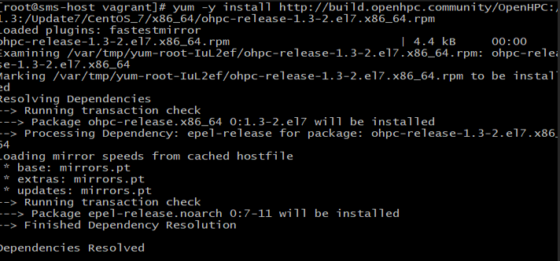
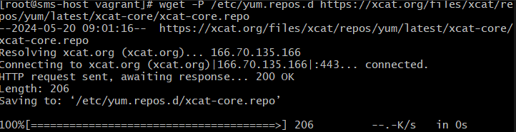
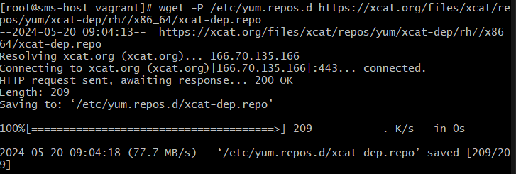
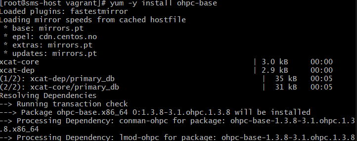
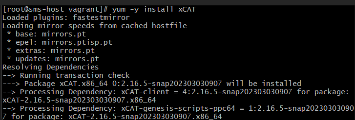

# hpc-cluster-setup

# Setting Up an HPC Cluster Using OpenHPC

This documentation outlines the steps to set up a High-Performance Computing (HPC) cluster using OpenHPC, Slurm for scheduling, and OnDemand for the API.

## Architecture

- **Login Nodes:** One or two nodes used by users for accessing the cluster.
- **Master Nodes:** One or two nodes used by administrators for installing packages and managing the cluster.
- **Compute Nodes:** Nodes used to run calculations.

## SMS Configuration

### Hostname and IP Configuration
```plaintext
Hostname: sms-host
IP (private/internal): 10.10.10.10/24
IP (public): NAT
``` 
## Prepare SMS Host Parameters

### Add sms hostname and ip to /etc/hosts 


### Disabling Firewall


## Enable OpenHPC Components

### Installing the ohpc repository

### Installing the epel repository

### Installing the xCAT repository


### Installing base package for ohpc

### Installing xCAT provisioning system
