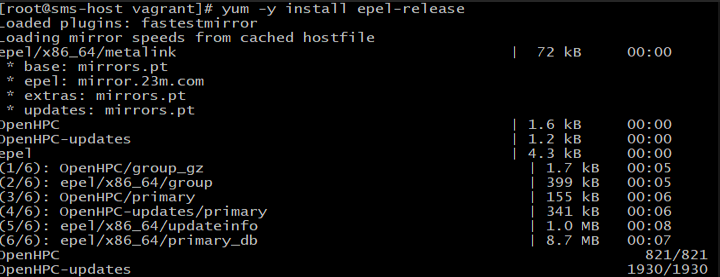
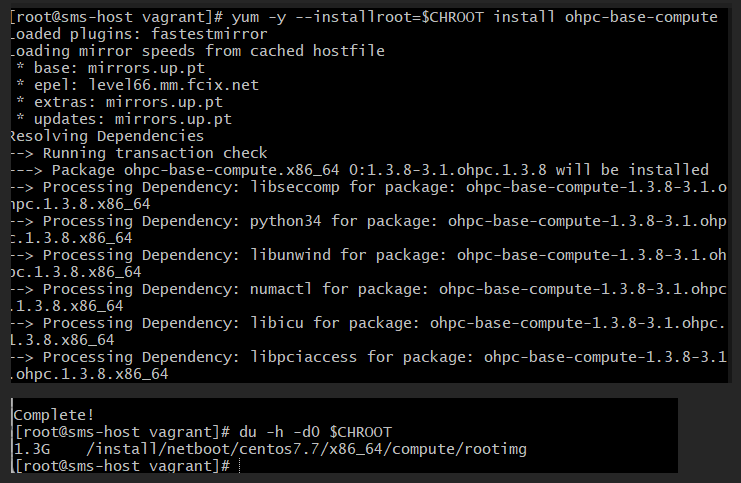

# hpc-cluster-setup

# Setting Up an HPC Cluster Using OpenHPC

This document outlines the steps to set up a High-Performance Computing (HPC) cluster using OpenHPC, Slurm for scheduling, and OnDemand for the API.

This document involves deploying an OpenHPC-ready Virtualbox VM using Vagrant.
the Vagrant deployment should allow for the same results on any other hypervisor of your preference (for example,
VMware).
- **pre-installed packages**
tmux & screen
vim
git
- **input.local (from OpenHPC) with custom edits which do not need to be replicated**
- **setenv.c** The setenv.c file contains predefined variables that will be used to configure the Master node. 


## Architecture


- **Login Nodes:** One or two nodes used by users for accessing the cluster.
- **Master Nodes:** One or two nodes used by administrators for installing packages and managing the cluster.
- **Compute Nodes:** Nodes used to run calculations.

## SMS Configuration

### Hostname and IP Configuration
```plaintext
Hostname: sms-host
IP (private/internal): 10.10.10.10/24
IP (public): NAT
```
#### The file setenv.c contains the variables for the env 

## Prepare SMS Host Parameters

### Add sms hostname and ip to /etc/hosts 


### Disabling Firewall


## Enable OpenHPC Components

### Installing the ohpc repository

### Installing the epel repository

### Installing the xCAT repository


### Installing base package for ohpc

### Installing xCAT provisioning system

### Enabling xcat tools for use in current shell

### Enabling support for local provisioning using a private interface and register this network interface with xCAT


## Add resource management services on master node

### Installing SLURM server meta-package

### Identify resource manager hostname on master host


## Resource Management Slurm

### nano /etc/slurm/slurm.conf

#### The line defines a set of compute nodes that will be managed by Slurm, the workload manager.
#### NodeName=c[1-4]: This specifies the names of the compute nodes that this entry applies to. The c[1-4] part uses a wildcard pattern to match nodes named c1, c2, c3, and c4.
#### Sockets=2: This indicates that each compute node has 2 CPU sockets.
#### CoresPerSocket=8: This indicates that each CPU socket on the compute nodes has 8 cores.
#### ThreadsPerCore=2: This defines the number of hardware threads per CPU core on the nodes. In this case, it's set to 2, which means hyper-threading is enabled.
#### State=UNKNOWN:  This shows the current state of the compute nodes as reported by Slurm. In this case, "UNKNOWN" suggests that Slurm hasn't been able to communicate with the nodes or determine their status yet.

#### In this virtual lab, there are only two compute nodes that will be used. The names of the compute nodes are compute00 and compute01. Each compute node has 1 socket, 2 cores per socket, and 1 thread per core.


## Define compute image for provisioning

#### copycds is used to copy the contents of Distribution CDs/DVDs or Service Pack CDs/DVDs to a specific directory on the xCAT cluster's head node.


### Save chroot location for compute image


### Build initial chroot image


### Adding openHPC Component
#### First, we need to enable the necessary package repositories for use inside the CHROOT.


#### Next, we need to copy the local package repositories inside the CHROOT.


#### Now we need to install the base compute packages on the CHROOT.



#### Add NFS client mount of /home and /opt/ohpc.pub to base image.


#### Export  /home and OpenHPC public packages from master server.


#### Enable ssh control via resource manager.


## Add NHC

### Install NHC on master and compute node.


### Register as SLURM’s health check program.


## Identify files for synchronization xCAT
#### The xCAT system includes functionality to synchronize files located on the SMS server for distribution to
#### managed hosts. This is one way to distribute user credentials to compute nodes (alternatively, you may
#### prefer to use a central authentication service like LDAP). To import local file-based credentials, issue the following to enable the synclist feature and register user credential files

### Define path for xCAT synclist file. 


### Add desired credential files to synclist

#### Similarly, to import the global Slurm configuration file and the cryptographic key that is required by the
#### munge authentication library to be available on every host in the resource management pool, issue the following


## Finalizing provisioning configuration


## Add Compute Nodes into xCAT Database
#### Next, we add compute nodes and define their properties as objects in xCAT database. These hosts are grouped logically into a group named compute to facilitate group-level commands used later in the recipe. Note the use of variable names for the desired compute hostnames, node IPs, MAC addresses, and BMC login credentials, which should be modified to accommodate local settings and hardware. To enable serial console access via xCAT, serialport and serialspeed properties are also defined.

### Define nodes as object on xCAT database.


#### With the desired compute nodes and domain identified, the remaining steps in the provisioning configuration process are to define the provisioning mode and image for the compute group and use xCAT commands to complete configuration for network services like DNS and DHCP. These tasks are accomplished as follows:


### Associate desired provisioning image for computes.


### Starting the compute node


#### Now the compute00 is up


## Resource Manager Startup
#### Services in preparation for running user jobs. Generally, this is a two-step process that requires starting up the controller daemons on the master host and the client daemons on each of the compute hosts. Note that Slurm leverages the use of the munge library to provide authentication services and this daemon also needs to be running on all hosts within the resource management pool. The following commands can be used to startup the necessary services to support resource management under Slurm.

### Start munge and slurm on the master host 


### Start slurm clients on compute hosts
